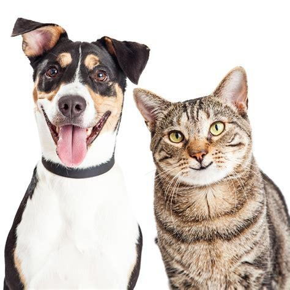
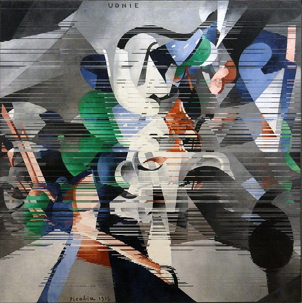
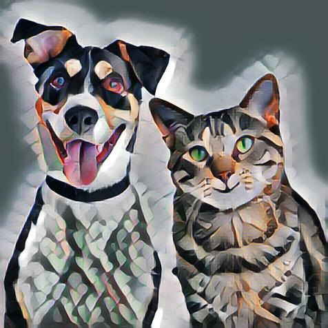

# GAN-AI-Assignment
> Convert any photos into an Aesthetic Arts

  
  
  

Stylize Any photo  in the style of famous paintings using Neural Style Transfer.
* This is hundreds of times faster than the optimization-based method presented by [Gatys et al](https://arxiv.org/abs/1508.06576) so-called fast style transfer.
*  We train a feedforward network that applies artistic styles to images using the loss function defined in [Gatys et al](https://arxiv.org/abs/1508.06576) paper.
* Feed forward network is a residual autoencoder network that inputs content image and spits out the stylized image.
* Model also uses instance normalization instead of batch normalization based on the paper [Instance Normalization: The Missing Ingredient for Fast Stylization](https://arxiv.org/abs/1607.08022)
* Training uses perceptual loss defined in the paper [Perceptual Losses for Real-Time Style Transfer and Super-Resolution](https://arxiv.org/abs/1603.08155).
* Vgg19 is used to calculate perceptual loss more closely described on paper.
* find [here](https://drive.google.com/drive/folders/1zHpVh5Sxhb0Z2xwctesmzLydMYTO9C2m?usp=sharing) dataset used in this code.
